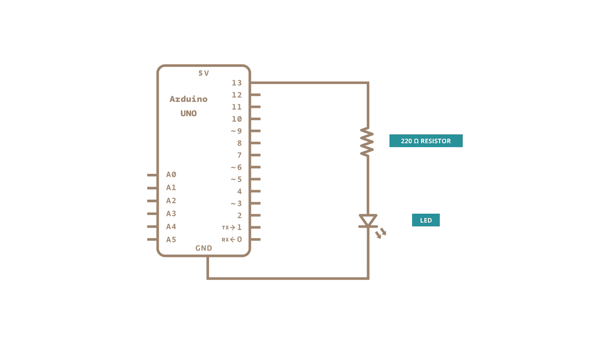
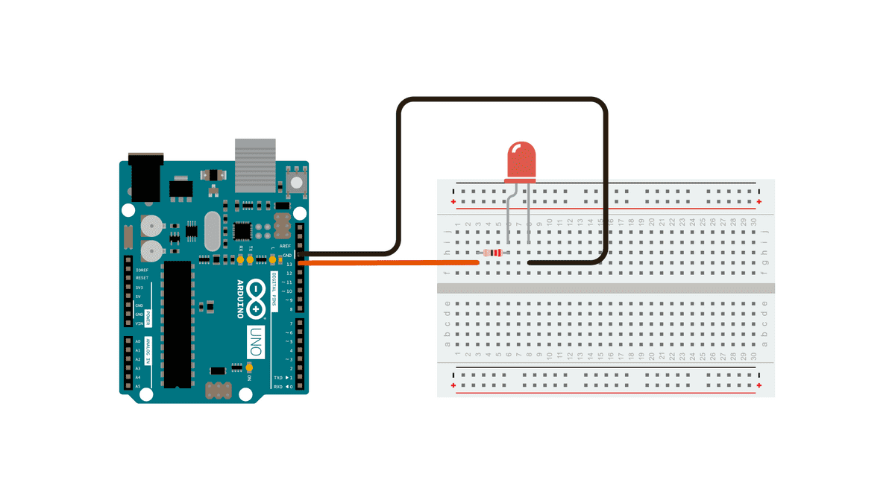

# High School Day 2: Programmable Electronics Workshop

## *Goal: Foster interest in participants to explore topics in the field of Electronics.*

## Learning Objectives

- Introduce Students to topics in Electronics and general Circuit-Building concepts
- Introduce Students to basic Arduino Microcontroller programming and how such devices can be used to create programmatic and functional systems
- Teach Students how various electronics components function and how they can be used to build circuits

## Resources and Materials

> **Note:** If attempting to use this specific module as a template for running a similar workshop, it is recommended that one checks component sources for prebuilt kits within the group's budget and structure the session around the parts available in the purchased kits, as prebuilt kits tend to be significantly less expensive than purchasing individual components separately, but can vary in terms of included contents with time. Furthermore, utilizing kits fundamentally decreases the amount of time needed to order, organize, and otherwise prepare materials for such activities.

[//]: # (TODO)

- Arduino kit
  - Arduino Uno
  - LED
- Computers running Arduino IDE
- Paper
- Writing Utensils (Pencils)

## Projects Overview

1. [Serial Monitor Hello World]()
2. [Builtin LED Blink]()
3. [External LED]()
4. [Button-Toggle LED]()
5. [Multiple External LED]()
6. [Multiple LED Blink]()

### `Time-permitting Challenges`

1. [Arduino LED Dice]()
2. [Binary Increment Counter]()

## Agenda

---

1. Briefly review the definition of a computer.
    > A computer is a machine or device that performs processes, calculations and operations based on instructions provided by a software or hardware program. It has the ability to accept data (input), process it, and then produce outputs.
    > <div style="text-align: right"> - Technopedia </div>

2. Explain what microcontrollers are and how the can be used to program electronic devices.

3. Introduce the Arduino Uno, a type of microcontroller built to be easy to set up and program through the Arduino IDE.

4. Guide students through connecting an Arduino Uno to the computer and setting up the IDE to be able to program the Arduino Uno.

5. Introduce the Serial Monitor, an easy way to receive text feedback from the microcontroller.

---

### [**Project 1: Serial Monitor Hello World**](https://arduinogetstarted.com/tutorials/arduino-hello-world)

```cpp
void setup() {
  // put your setup code here, to run once:
  Serial.begin(9600);
  Serial.println("Hello World!");
}

void loop() {
  // put your main code here, to run repeatedly:

}
```

---

6. Introduce the built-in LED, which can be controlled by changing the voltage of the builtin LED pin on the Arduino Uno.

---

### [**Project 2: Builtin LED Blink**](https://www.arduino.cc/en/Tutorial/BuiltInExamples/Blink)

```cpp
// the setup function runs once when you press reset or power the board
void setup() {
  // initialize digital pin LED_BUILTIN as an output.
  pinMode(LED_BUILTIN, OUTPUT);
}

// the loop function runs over and over again forever
void loop() {
  digitalWrite(LED_BUILTIN, HIGH);   // turn the LED on (HIGH is the voltage level)
  delay(1000);                       // wait for 1000 milliseconds (1 second)
  digitalWrite(LED_BUILTIN, LOW);    // turn the LED off by making the voltage LOW
  delay(1000);                       // wait for 1000 milliseconds (1 second)
}
```

---

7. Introduce external LEDs (with resistors) and show how they can be powered by the Arduino's VCC pin.
    - Warn of the dangers of using LEDs without a resistor. (Demonstrate?)
8. Explain GPIO pins and how they can be used as an output to programmatically control voltage along a wire.

---

### [**Project 3: External LED Blink**](https://www.arduino.cc/en/Tutorial/BuiltInExamples/Blink)

#### Schematic



#### Wiring Diagram



```cpp
// define the GPIO pin the external LED is connected to
#define LED_PIN 13

// the setup function runs once when you press reset or power the board
void setup() {
  // initialize digital pin LED_PIN as an output.
  pinMode(LED_PIN, OUTPUT);
}

// the loop function runs over and over again forever
void loop() {
  digitalWrite(LED_PIN, HIGH);   // turn the LED on (HIGH is the voltage level)
  delay(1000);                       // wait for 1000 milliseconds (1 second)
  digitalWrite(LED_PIN, LOW);    // turn the LED off by making the voltage LOW
  delay(1000);                       // wait for 1000 milliseconds (1 second)
}
```

9. Introduce push-button switches and how they can be used to close a circuit so that current can flow through it.

10. Explain how GPIO pins can be used as an input to detect changes in the voltage on its pins.

---

### [**Project 4: Button-Toggle LED**](https://arduinogetstarted.com/tutorials/arduino-button-toggle-led)

```cpp
#define BUTTON_PIN 7 // Arduino pin connected to button's pin

// Variables that will change:
int ledState = LOW;     // the current state of LED
int lastButtonState;    // the previous state of button
int currentButtonState; // the current state of button

void setup() {
  Serial.begin(9600);                // initialize serial
  pinMode(BUTTON_PIN, INPUT_PULLUP); // set arduino pin to input pull-up mode
  pinMode(LED_PIN, OUTPUT);          // set arduino pin to output mode

  currentButtonState = digitalRead(BUTTON_PIN);
}

void loop() {
  lastButtonState    = currentButtonState;      // save the last state
  currentButtonState = digitalRead(BUTTON_PIN); // read new state

  if(lastButtonState == HIGH && currentButtonState == LOW) {
    Serial.println("The button is pressed");

    // toggle state of LED
    ledState = !ledState;

    // control LED according to the toggled state
    digitalWrite(LED_PIN, ledState); 
  }
}
```

---

### **Multiple External LED**

---

### **Multiple LED Blink**

---

### **Arduino LED Dice**

---

### **Binary Increment Counter**
